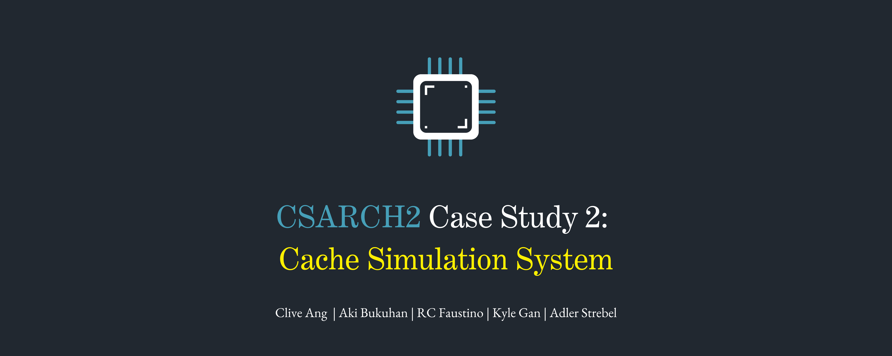
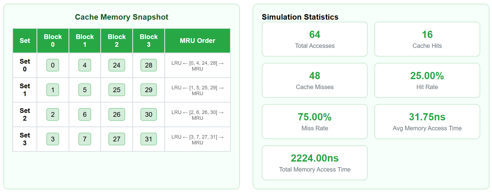

## 1. Introduction
This case study is a **cache simulation system** designed to model and analyze memory access behavior under a **4-way set associative mapping** with the **MRU (Most Recently Used)** replacement policy. The simulator allows generating different memory access patterns, observing cache behavior, and analyzing performance metrics including **hit rate**, **miss rate**, and cache snapshots.  

The purpose of this case study is to:
- Understand cache memory operations and replacement policies.
- Evaluate cache performance under different memory access patterns.
- Provide a foundation for web-based visualization of cache behavior.

### 1.1 Demo Link
[Google Drive Link](https://drive.google.com/file/d/1QtfwOfn_fEatLiSHlxuUQUMgrb3zLo7c/view?usp=sharing)

## 2. System Specifications
The cache simulation system follows these specifications:

| Parameter              | Specification                                                |
|------------------------|--------------------------------------------------------------|
| Cache Mapping           | 4-way Set Associative                                       |
| Replacement Policy      | MRU (Most Recently Used)                                    |
| Read Policy             | Non-load-through                                            |
| Cache Access Time       | Fixed at 1ns                                                |
| Memory Access Time      | Fixed at 10ns                                               |
| Cache Line Size         | Configurable (at least 2 words, power of 2)                 |
| Cache Blocks            | Configurable (at least 4 blocks, power of 2)                |
| Memory Blocks           | Fixed (1024 blocks)                                         |
| Sequence Types Supported| Sequential, Mid-Repeat, Random, Custom                      |
| Output                  | Cache snapshot, hit/miss metrics, average/total access time |

## 3. Implementation Details

### 3.1 Cache Mapping (4-Way Set Associative)
The cache is divided into **sets**, where each set can store **4 cache blocks**. The number of sets is calculated as:  

$$ \text{sets} = \dfrac{\text{cache blocks}}{\text{ways}} $$

Additionally, a memory block maps to a specific cache set using:  

$$ \text{set index} = \text{block number} \bmod \text{sets} $$

This mapping allows blocks to be distributed evenly across the cache sets.

### 3.2 Replacement Policy (MRU)
The simulator uses the **MRU (Most Recently Used)** replacement policy:
- On a **cache hit**, the accessed block is moved to the MRU position in its set.
- On a **cache miss**, if the set is full, the MRU block is replaced with the new block.  

This approach is the opposite of LRU (Least Recently Used) and favors evicting the block that was accessed most recently, which is suitable for certain scenarios where recently accessed blocks may not be reused soon.

### 3.3 Read Policy
The simulator implements a **non-load-through read policy**, meaning that when a cache miss occurs:
- The required block is fetched from main memory into the cache.
- The CPU retrieves the data from memory, not directly from cache for that particular access.

### 3.4 Test Sequence Generation
The simulator supports four types of test sequences:
1. **Sequential**:  
   Accesses memory blocks in a strictly increasing order, up to `2 × cacheBlocks`, then repeats twice.
2. **Mid-Repeat**:  
   Starts from block 0, repeats the middle range (`1..n-2`) twice, then continues sequentially and repeats the entire sequence twice.
3. **Random**:  
   Generates 64 random memory block accesses between `0–1023`.
4. **Custom**:  
   A custom number of memory block accesses dictated by the user.

Each sequence tests a different cache access behavior.

### 3.5 Output
For each simulation run, the system outputs:
- **Final cache snapshot**: Displays the state of each cache set.
- **Performance metrics**:
  - Total memory accesses
  - Cache hit count
  - Cache miss count
  - Cache hit rate
  - Cache miss rate
  - Average access time
  - Total access time

## 4. Test Case Scenarios

To evaluate the cache simulation, three different memory access patterns were tested. Each pattern is designed to highlight different cache behaviors when using a **4-way set associative mapping** with **MRU replacement policy**.

### 4.1 Sequential Sequence
This test case simulates accessing memory blocks in strictly increasing order, up to **2 × cacheBlocks**, and then repeats the sequence twice. This is to observe how the cache handles predictable, ordered memory access. Additionally, it is expected to initially cause cache misses until the cache fills, then demonstrate some cache hits as blocks remain in the cache.

**Example (cacheBlocks = 4):**  
```
0, 1, 2, 3, 4, 5, 6, 7, 0, 1, 2, 3, 4, 5, 6, 7
```

### 4.2 Mid-Repeat Sequence
This test case starts at block `0`, repeats the middle range (`1` to `n-2`) twice, continues sequentially up to `2 × cacheBlocks`, and then repeats the sequence twice. This is to analyze cache performance when certain blocks are accessed more frequently in the middle of the sequence. Additionally, it is expected to result in a higher hit rate in the repeated middle section.

**Example (cacheBlocks = 4):**  
```
0, 1, 2, 3, 1, 2, 3, 4, 5, 6, 7, 0, 1, 2, 3, 1, 2, 3, 4, 5, 6, 7
```

### 4.3 Random Sequence
This test case randomly selects 64 random memory blocks from `0–1023` and accesses them. This is to observe cache behavior under unpredictable access patterns. Additionally, it is expected to generate more cache misses compared to other test cases especially since it has 1024 different memory blocks to randomly choose from.

**Example (64 random blocks):**  
```
25, 90, 7, 102, 56, 7, 400, 512, 90, 18, ...
```

## 5. Results & Metrics  

The simulation produces performance metrics for each test case. These metrics help analyze the effectiveness of the **4-way set associative cache** with **MRU replacement policy**.  

### 5.1 Reported Metrics  
| Metric                  | Description                                                                 |
|-------------------------|-----------------------------------------------------------------------------|
| Total Memory Accesses     | Total number of memory block accesses performed during the test.           |
| Cache Hit Count         | Number of memory accesses served from the cache.                           |
| Cache Miss Count        | Number of memory accesses that required fetching from memory.              |
| Cache Hit Rate (%)      | `(Hit Count / Total Accesses) × 100`                                       |
| Cache Miss Rate (%)     | `(Miss Count / Total Accesses) × 100`                                      |
| Final Cache Snapshot    | The final state of each cache set after all memory accesses.               |
| Average Access Time | `(Hit Rate × CAT) + (Miss Rate × Miss Penalty)`
| Total Access Time | `Hits × (CAT × Block Size) + Misses × [CAT + (MAT + Block Size) + (CAT × Block Size)]`

### 5.2 Example Results (Cache: 16 blocks, 4 words)  
| Test Case        | Memory Accesses | Cache Hits | Cache Misses | Hit Rate (%) | Miss Rate (%) | Avg. Access Time | Total Access Time |
|-----------------|-----------------|-------------|--------------|--------------|---------------|------------------|-------------------|
| Sequential      | 64              | 16          | 48           | 25%          | 75%           | 31.75ns          | 2224.00ns         |
| Mid-Repeat      | 94              | 42          | 52           | 44.68%       | 55.32%        | 23.68ns          | 2508.00ns         |
| Random          | 64              | 2           | 62           | 3.13%        | 96.88%        | 42.00ns          | 2880.00ns         |

### 5.3 Example Final Cache Snapshot (After Sequential Test)  
| Set Index | Cache Blocks (LRU → MRU) |
|-----------|-------------------------|
| 0         | [0, 4, 24, 28]           |
| 1         | [1, 5, 25, 29]           |
| 2         | [2, 6, 26, 30]          |
| 3         | [3, 7, 27, 31]          |

### 5.4 Example Screenshot



## 6. Analysis of Test Results  

The cache simulation results highlight how different access patterns interact with a **4-way set associative cache** using the **MRU replacement policy**.  

### 6.1 Sequential Test Analysis
- The first pass through the sequence results mostly in cache misses as the cache fills up. In subsequent passes, many blocks are reused, leading to an improved hit rate.  
- MRU tends to evict the most recently used block in each set. For sequential access, this does not harm performance significantly because blocks are not revisited immediately after they are used.  
- The hit rate improves after the first loop, stabilizing at around 25%.

### 6.2 Mid-Repeat Test Analysis  
- The repeated middle section leads to increased cache hits because the same blocks are accessed multiple times before the sequence continues.  
- MRU replacement works well here. Since the most recently used blocks (from the repeated middle sequence) are the first candidates for replacement, the policy quickly cycles them, but because they are accessed frequently, they get re-inserted, resulting in more hits.  
- This pattern shows how MRU can handle scenarios with high temporal locality in a small subset of memory.

### 6.3 Random Test Analysis  
- Random access produces the lowest hit rate due to the lack of locality. Cache blocks are frequently replaced before they can be reused.  
- MRU replacement in this scenario performs similarly to other policies (e.g., LRU or FIFO) because accesses are unpredictable. The difference between replacement policies becomes negligible for random workloads.  
- High miss rates are expected for random patterns, demonstrating that cache effectiveness heavily depends on predictable or repeated access patterns.

### 6.4 Key Insights  
1. MRU works well for patterns with frequent re-access of the same blocks (e.g., mid-repeat).  
2. For strictly sequential patterns, MRU performs adequately but does not provide a clear advantage over other policies.  
3. Random patterns expose cache limitations regardless of the replacement strategy, leading to a high miss rate.  
4. Increasing cache size would generally improve hit rates for all test cases.  

## 7. Limitations  

While the cache simulation system successfully models cache behavior under a 4-way set associative mapping with MRU replacement, several limitations should be noted:  

- The simulation focuses only on cache mapping and replacement policies. It does not account for real-world factors such as cache write policies (e.g., write-through or write-back).  
- The system assumes a fixed memory size of **1024 blocks**, which simplifies the simulation but may not reflect realistic memory hierarchies in larger systems.  
- Only **MRU replacement** is supported. Other common policies like LRU, FIFO, or random replacement are not yet implemented but could be added for comparison.  
- The simulator only supports four sequence types (sequential, mid-repeat, random, and custom). Real-world applications may involve more complex access patterns that would require additional sequence generation options.  

## 8. Conclusion  

The cache simulation demonstrates how a*4-way set associative cache with the MRU replacement policy behaves under various access patterns.  

Key findings include:  
- **Sequential access** initially results in many misses but stabilizes at a moderate hit rate (~25%) after the cache warms up, showing that MRU is not detrimental for predictable access patterns.  
- **Mid-repeat access** benefits the most from MRU due to frequent re-access of the same blocks, which allows MRU to maintain high temporal locality and improved hit rates.  
- **Random access** produces the lowest hit rates, showing that MRU provides no clear advantage when locality is absent and that replacement policies converge in effectiveness for such workloads.  

These results show that cache performance is dependent on the sequence patterns and cache configuration. MRU is particularly effective for workloads with frequent re-access to a small subset of blocks, but less impactful for purely sequential or random workloads. 

Future recommendations could include:  
- Implementing additional replacement policies (e.g., LRU, FIFO) for comparison.  
- Supporting larger and more realistic memory configurations.  
- Incorporating write policies and more complex sequence generation to better model real-world scenarios.  
